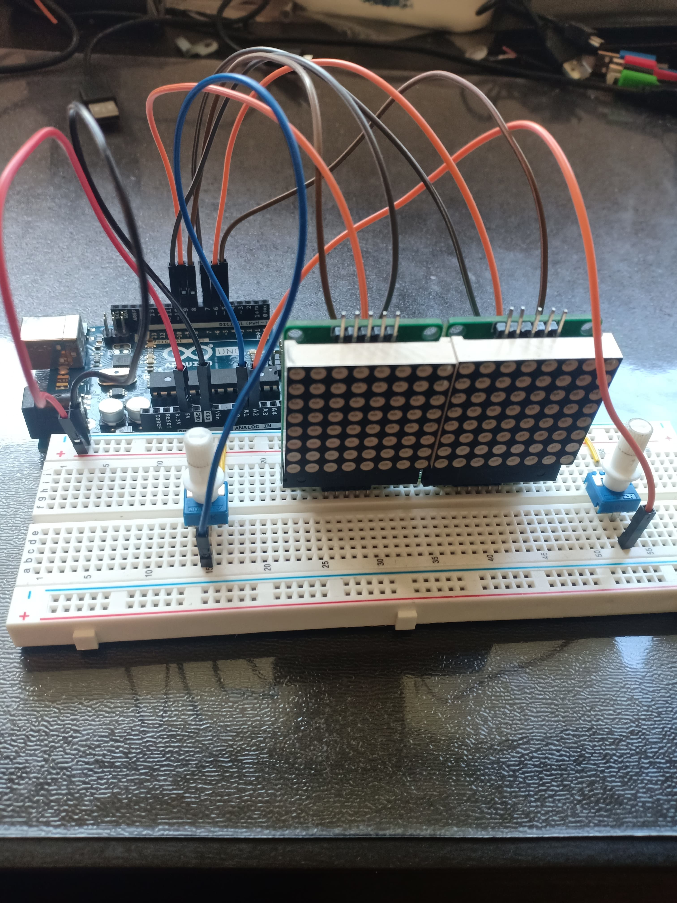
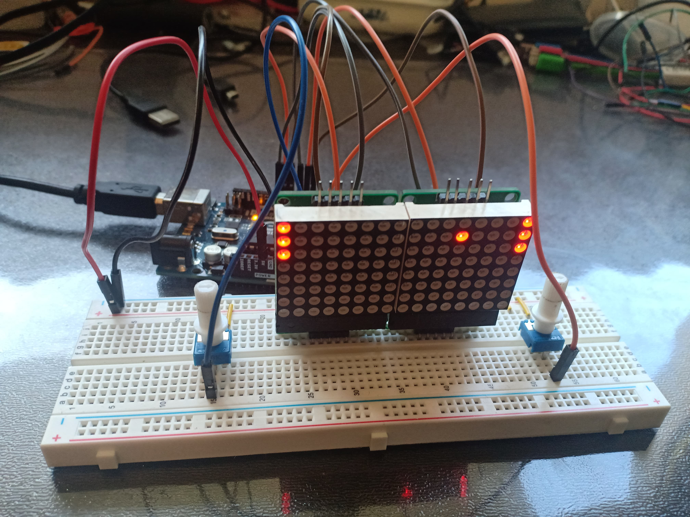

# Arduino Pong

A pong game made with an arduino uno, 2 8x8 led matrix and 2 potentiometers

## Pinout

Like described in src/constants.h

```c
// Pins matrix 1
#define PIN_CLK_LEFT (8)
#define PIN_CS_LEFT (9)
#define PIN_DIN_LEFT (10)

// Pins matrix 2
#define PIN_CLK_RIGHT (5)
#define PIN_CS_RIGHT (6)
#define PIN_DIN_RIGHT (7)

// Potentiometer 1
#define POTENTIOMETER_PIN_LEFT (A1)

// Potentiometer 2
#define POTENTIOMETER_PIN_RIGHT (A2)
```

## Build

- Install [PlatformIO](https://platformio.org/)

```
$ make
```

## Flash

```
$ make flash
```

## What it looks like




## Licence
This project is licensed under the terms of the MIT license.
